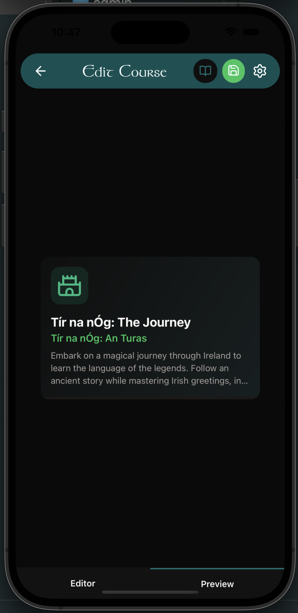

# Navaria Admin Guide

**📘 Documentation Navigation:**
[← Back to README](./README.md) | [← Setup Guide](./COMMUNITY_SETUP.md) | [Deployment Guide →](./DEPLOYMENT_GUIDE.md) | [Development Guide](./DEVELOPMENT.md)

---

This guide explains how to use Navaria's built-in admin panel to create and manage course content for your language learning platform.

## Table of Contents

1. [Accessing the Admin Panel](#accessing-the-admin-panel)
2. [Admin Dashboard Overview](#admin-dashboard-overview)
3. [Creating Your First Language](#creating-your-first-language)
4. [Creating a Course](#creating-a-course)
5. [Building Lessons](#building-lessons)
6. [Adding Exercises](#adding-exercises)
7. [Managing Speakers](#managing-speakers)
8. [Working with Audio Files](#working-with-audio-files)
9. [Content Structure Best Practices](#content-structure-best-practices)
10. [Tips & Troubleshooting](#tips--troubleshooting)

---

## Accessing the Admin Panel

### Prerequisites

You must have admin access configured. See [COMMUNITY_SETUP.md](./COMMUNITY_SETUP.md#creating-your-first-admin-user) for instructions on granting admin privileges.

### Opening the Admin Panel

1. Launch the Navaria app
2. Log in with your admin account
3. Tap the **menu icon** (☰ hamburger menu in top-left)
4. Select **Admin Panel** from the drawer menu

You'll see the Admin Dashboard with options to manage:

- **Courses** - Create and organise language courses
  - Click a course to edit it
  - Click the + button to create a new course
- **Speakers** - Define speakers to be used in exercises
  - Click 'speakers' to view and manage speakers

<p align="center">
  
  <br/>
  <em>Course cards as seen in the admin panel</em>
</p>

---

## Languages in Navaria

Before creating courses, you need languages defined in your system.

### Default Languages Included

If you ran the `init_schema.sql` script, the following languages are already available:

- **Irish (Gaeilge) - Standard** (`irish_std`)
- **Irish (Gaeilge) - Munster** (`irish_mun`)
- **Irish (Gaeilge) - Connacht** (`irish_con`)
- **Irish (Gaeilge) - Ulster** (`irish_ul`)
- **Navajo (Diné bizaad)** (`navajo`)
- **Māori (Te Reo Māori)** (`maori`)

**You can skip to [Creating a Course](#creating-a-course) if you're teaching one of these languages.**

### Adding Additional Languages

If you need to add a new language (e.g., Welsh, Scottish Gaelic, etc.):

#### Step 1: Access the Database

Languages are managed directly in Supabase (not through the app UI).

1. Go to your Supabase dashboard
2. Click **Table Editor**
3. Find the **languages** table

#### Step 2: Add a Language

Click **Insert row** and fill in:

| Field            | Description                         | Example                              |
| ---------------- | ----------------------------------- | ------------------------------------ |
| **id**           | Unique identifier                   | `welsh` or `scottish_gaelic`         |
| **code**         | ISO 639 language code (2-3 letters) | `cy` (Welsh), `gd` (Scottish Gaelic) |
| **name**         | Full language name                  | `Welsh (Cymraeg)`                    |
| **voice_prefix** | Prefix for voice files (optional)   | `cy_`                                |

In your code editor, search for references to existing languages and add your new language to the returned instances. TODO: this can be streamlined in the future.

#### Step 3: Verify

Return to the app and check the course selection screen - your language should now appear!

---

## Building Lessons & Exercises

It is recommended to **create your lessons first**, before creating the course container. This makes it easier to structure the course flow later.

### Step 1: Create a Lesson

1. From the **Course Editor**, tap **+ Create new Lesson**.
2. Fill in the lesson details:
   - **Title**: e.g., "Greetings"
   - **Description**: General internal description of the lesson.
   - **Order**: General sorting order (also used when adding to course).
3. **Click Save**.
4. **Click Preview** to see how the lesson card looks.

### Step 2: Add Content to Lesson

Once the lesson is created:

1. Tap on the lesson to open the **Lesson Editor**.
2. Add **Content Blocks**:
   - **Text**, **Images**, **Audio**, **Video**: Teaching materials.
   - **Exercise**: Interactive practice.

> [!TIP]
> **Preview Frequently!**
> As you add blocks, click the **Preview** button often to see exactly how the content will render in the app.

### Step 3: Configure Exercises

When you add an **Exercise** block:

1. Choose a type (Standard, Cloze, Matching Pairs).
2. Add **Units** (Questions).
3. **Click Save** on the unit and the exercise block to prevent data loss.

<p align="center">
  
  <br/>
  <em>Create various exercise types: typing, cloze, matching pairs, and more</em>
</p>

repeat this process for all the lessons you plan to teach.

---

## Creating a Course

Once your lessons are ready, you can create the course container and link them together.

### Step 1: Create Course & Details

<p align="center">
  
  <br/>
  <em>Course creation interface with customization options</em>
</p>

1. From the Admin Dashboard, select a language.
2. Click **+ New Course**.
3. Fill in the details (Title, Description, Icon, Colour).
4. **Click Save**.
5. **Click Preview** to see the course card.

<p align="center">
  
  <br/>
  <em>Preview your course before publishing</em>
</p>

### Step 2: Structure Course Content

This is where you define the flow of your user's journey.

<p align="center">
  
  <br/>
  <em>Build lessons with rich content blocks (no code required)</em>
</p>

1. In the Course Manager, click on your course, then **Edit Content**.
2. Add **Content Blocks** to structure the flow:
   - **Intro Video/Text**: Welcome the student.
   - **Lesson Block**: Select 'Lesson' type and choose one of your pre-made lessons.
   - **Bridge Content**: Add audio or text between lessons (e.g., "Great job on Lesson 1! Now let's try...").
   - **Lesson Block**: Add the next lesson.
     - - As you add lessons to a course, they are added in the order you add them, and you can select which other lessons are prerequisites for this lesson i.e. which lessons must be completed before this one unlocks.\*
3. **Click Save** frequently to store your course structure.

<p align="center">
  
  <br/>
  <em>Add lessons to your course in the desired order</em>
</p>

<p align="center">
  
  <br/>
  <em>Set lesson prerequisites to control learning progression</em>
</p>

> [!TIP]
> You can re-order blocks to change the flow.

---

---

## Managing Speakers

Speakers add personality to conversational exercises. Each speaker has a profile picture or avatar.

<p align="center">
  
  <br/>
  <em>Manage speakers with custom avatars and profiles</em>
</p>

### Step 1: Open Speaker Manager

1. From Admin Panel, tap **Speakers**

### Step 2: Create a Speaker

1. Tap **+ (Plus)** button
2. Fill in speaker details:

| Field               | Description                         | Example                             |
| ------------------- | ----------------------------------- | ----------------------------------- |
| **Name**            | Speaker's name                      | `Máire`                             |
| **Display Name**    | Name shown to students              | `Máire`                             |
| **Profile Picture** | Custom avatar or preselected avatar | Upload image or choose from gallery |
| **Dialect**         | Language variant (optional)         | `Munster`, `Connacht`               |
| **Gender**          | Speaker's gender (optional)         | `Female`, `Male`                    |

3. Tap **Save**

### Speaker Best Practices

- Create 2-4 speakers per language for variety
- Use distinct profile pictures for easy visual recognition
- Choose relatable names from the language's culture
- Add dialect information to help students learn regional variations
- Balance gender representation

---

## Working with Audio Files

Audio is crucial for pronunciation learning. Navaria supports audio at multiple levels:

### Audio Types

1. **Sentence Audio**: Full sentence pronunciation
2. **Word Audio**: Individual word pronunciation
3. **Content Block Audio**: Standalone audio lessons

### Adding Sentence Audio

#### Method 1: Record in App (Recommended)

Navaria includes a built-in audio recorder:

<p align="center">
  
  <br/>
  <em>Record audio directly in the app with speaker selection</em>
</p>

1. In the **Exercise Editor**, ensure you have defined **Speakers** first (see Managing Speakers).
2. Select the Speaker you want to record as (tap their name/avatar).
3. Tap the **Record Audio** button (microphone icon).
4. Record the sentence or word.
5. Tap **Use Recording** to save it to the unit.
6. The audio is automatically uploaded and linked to the correct speaker.

<p align="center">
  
  <br/>
  <em>Add audio at word or sentence level with speaker attribution</em>
</p>

#### Method 2: Direct Database Entry (Bulk Import)

### Adding Word Audio

For word-by-word pronunciation:

1. In Supabase, go to **word_audio** table
2. Insert row:
   ```
   unit_id: [ID of the exercise unit]
   word: "dia"
   audio_url: course_media/words/dia.mp3
   position: 1
   ```

### Audio File Guidelines

| Specification    | Recommendation                                |
| ---------------- | --------------------------------------------- |
| **Format**       | MP3 or M4A                                    |
| **Bitrate**      | 64-128 kbps (voice is fine at lower bitrates) |
| **Sample Rate**  | 44.1 kHz or 48 kHz                            |
| **Max Duration** | 10 seconds per sentence                       |
| **Naming**       | Descriptive and consistent: `ga_hello_01.mp3` |

### Recording Tips

- Use a quiet environment
- Record with a quality microphone (even phone mics work)
- Speak clearly at a natural pace
- Include a brief pause before and after each sentence
- Consider recording native speakers if possible

---

## Content Structure Best Practices

### Course Organization

```
Course: Irish for Beginners
├── Lesson 1: Greetings (50 XP)
│   ├── Exercise 1: Basic Hellos (3 units)
│   ├── Exercise 2: Goodbyes (3 units)
│   └── Exercise 3: Practice Dialogue (4 units)
├── Lesson 2: Introductions (75 XP)
│   ├── Exercise 1: What's Your Name? (4 units)
│   └── Exercise 2: Where Are You From? (4 units)
└── Lesson 3: Numbers 1-10 (75 XP)
    └── ...
```

### Recommended Progression

1. **Start Simple**: First lessons should have 2-3 exercises with 2-3 units each
2. **Gradual Complexity**: Increase units per exercise as students progress
3. **Review Lessons**: Every 5-10 lessons, add a review lesson mixing previous content
4. **XP Scaling**: Start with 50-100 XP per lesson, increase to 150-200 for advanced lessons

### Exercise Variety

Mix exercise types within a lesson:

- **Standard typing**: Type out Irish sentences with custom keyboard support for fadas and special characters
- **Cloze exercises**: Test specific vocabulary or grammar in context
- **Matching pairs**: Reinforce word-to-meaning connections
- **Conversational practice**: Dialogue exercises with speakers (using any exercise type)

### Content Pacing

| Lesson Range | Content Focus                  | Units per Exercise |
| ------------ | ------------------------------ | ------------------ |
| 1-5          | Single words, simple phrases   | 2-3                |
| 6-15         | Short sentences, basic grammar | 3-5                |
| 16-30        | Full sentences, conversations  | 4-6                |
| 30+          | Complex sentences, idioms      | 5-8                |

---

## Tips & Troubleshooting

### Creating Engaging Content

✅ **Do:**

- Use authentic, everyday language
- Include cultural context in descriptions
- Add humor and personality through speakers
- Test your content by having someone else try it
- Provide literal translations in descriptions when helpful

❌ **Don't:**

- Create overly long exercises (max 8 units)
- Use formal/archaic language for beginner content
- Skip audio (pronunciation is critical)
- Make early lessons too difficult

### Common Issues

#### "My course doesn't appear in the app"

- Check that the language's `is_active` is `true`
- Ensure the course has at least one published lesson
- Try force-closing and reopening the app

#### "Audio not playing"

- Verify the audio file exists in Supabase Storage
- Check the file is in the `audio` bucket
- Ensure the bucket is public
- Verify the `audio_url` path is correct (no leading `/`)

#### "Can't reorder lessons/exercises"

- Order is determined by the `order` field (integer)
- Lower numbers appear first
- Use increments of 10 for easy reordering

### Bulk Content Import

For large content sets:

1. Prepare a CSV or JSON file with your content
2. Use Supabase's import feature (Table Editor → Import)
3. Or write a script using the Supabase API
4. See `scripts/` folder for examples (if available)

---

## Next Steps

Once you've created your course content:

1. **Test thoroughly**: Go through lessons as a student
2. **Get feedback**: Have native speakers review pronunciation
3. **Iterate**: Update content based on learner feedback
4. **Deploy**: Share your app with students (see [DEPLOYMENT_GUIDE.md](./DEPLOYMENT_GUIDE.md))

---

## Content Sharing

If you create content for endangered/minority languages, consider:

- Sharing your content structure with other educators
- Contributing to community course libraries
- Documenting your pedagogical approach

**Happy teaching!** 🎓📱

---

## Additional Resources

- **Supabase Docs**: [supabase.com/docs](https://supabase.com/docs)
- **Main README**: [README.md](./README.md) - Technical documentation
- **Setup Guide**: [COMMUNITY_SETUP.md](./COMMUNITY_SETUP.md) - Initial setup
- **Deployment**: [DEPLOYMENT_GUIDE.md](./DEPLOYMENT_GUIDE.md) - Publishing your app
