# Navaria

**A free, open-source platform for creating and hosting your own language-learning content — with full control and privacy over your content, students, and data.** Feel free to use this for yourself, your business, your classes, tribe, community, or any other purpose.

Navaria is **software you deploy yourself**.

By following the setup guides in this repository, you can create **your own private or public instance** of Navaria — fully under your control — and use it to teach **your own language**, with **your own lessons**, for **your own students or community**.

Although I have a special interest in preserving endangered languages, Navaria is not limited to this. I have created this project to be a general language learning platform, and included features that allow the app to be customised and extended in various ways. Dive in!

### What you get when you deploy Navaria

- 🏗️ **Your own instance** (not shared with anyone else)
- 🔐 **Full control over content, users, and courses**
- 🧑‍🎓 **Private access for your students** (or public, if you choose)
- 🎨 Optional custom branding and domain
- 💾 Your own database and storage
- 🚫 No platform lock-in, no ads, no fees

Navaria is **free and open source (MIT License)**.

You may:
- Use it privately or publicly  
- Modify it for your needs  
- Deploy it for schools, communities, or commercial projects  
- Share it with your students under your own rules  

👉 **If you can follow step-by-step instructions, you can run Navaria. No prior platform experience required.**

---

## Visual Showcase

<table>
  <tr>
    <td width="33%">
      
      <p align="center"><em>Choose from multiple languages</em></p>
    </td>
    <td width="33%">
      
      <p align="center"><em>Browse interactive courses</em></p>
    </td>
    <td width="33%">
      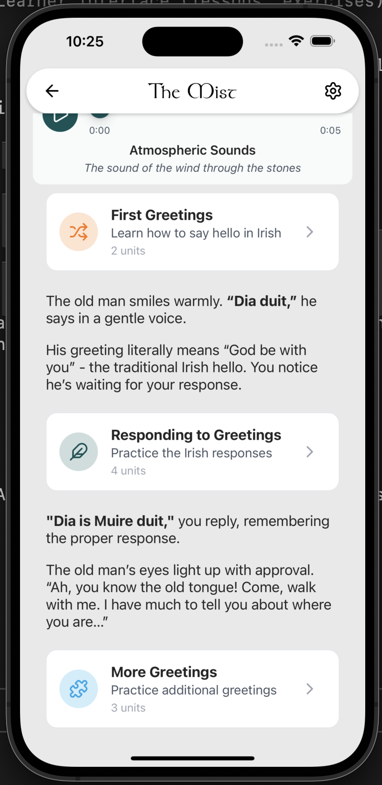
      <p align="center"><em>Engage with interactive exercises</em></p>
    </td>
  </tr>
  <tr>
    <td width="33%">
      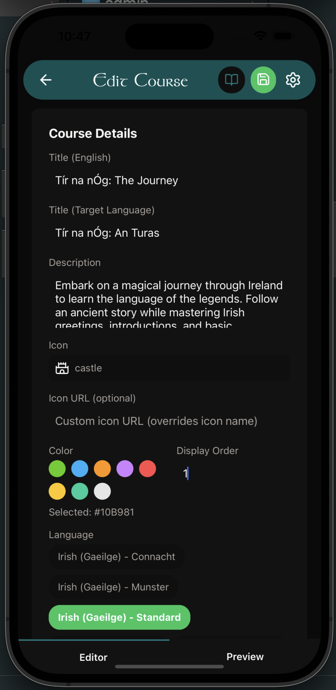
      <p align="center"><em>No-code course creation</em></p>
    </td>
    <td width="33%">
      
      <p align="center"><em>Build lessons with rich content</em></p>
    </td>
    <td width="33%">
      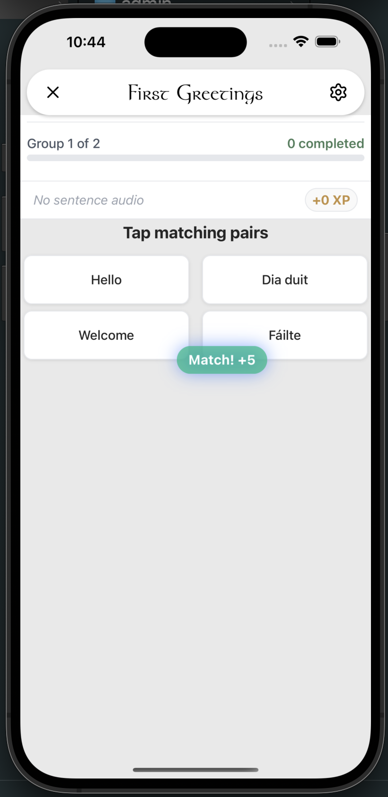
      <p align="center"><em>Track progress with XP & achievements</em></p>
    </td>
  </tr>
</table>

---

> **Note:** A public *community instance* also exists for shared experimentation and collaboration — but it is entirely optional. Most educators and organisations deploy their **own private instance**. The community instance is **empty** and waiting for **you** to create content. If you would like to create content for the community version, you can contact me and I'll add you to the admins list, then you can create content with no-code for the wider community to use.

---

## 🌍 Our Mission

Thousands of languages around the world are at risk of disappearing. Navaria provides the tools needed to:

- **Preserve** endangered and minority languages for future generations
- **Empower** educators with a complete, customisable learning platform
- **Connect** communities through accessible language education
- **Distribute** language courses freely to learners worldwide

---

## 🌐 Community Version

You can access the live community version here: [Navaria Community App](https://navaria-community.navaria.pages.dev/)

This instance is running for the community. It's currently empty, waiting for **you** to create content. If you would like to create content for the community version, you can contact me and I'll help you get started with admin access.

---

## Who Is This For?

Navaria is designed for anyone committed to language preservation and education:

- ### 🏫 **Schools & Educational Institutions**

  Deploy your own instance to teach indigenous or minority languages to students. Full control over content, branding, and deployment.

- ### 👨‍🏫 **Private Educators & Teachers**

  Create comprehensive language courses with interactive exercises, audio pronunciation, and progress tracking.

- ### 🌐 **Language Preservation Organisations**

  Build and distribute courses for endangered languages. Reach learners globally or within your community.

- ### 👥 **Community Groups**

  Revitalise and share your language with custom courses tailored to your community's needs.

- ### 📚 **Language Enthusiasts**
  Learn and contribute to the preservation of minority languages through community-created content.

---

## Features

### 🎓 **For Learners**

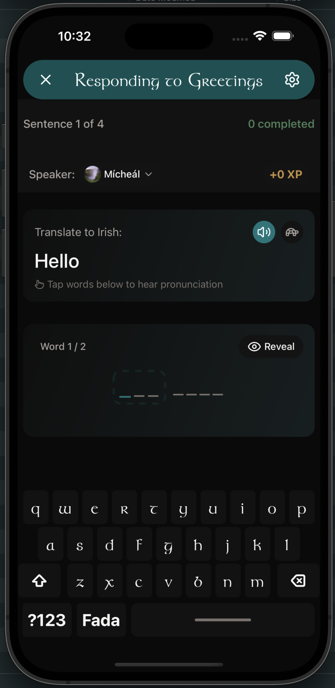

- **Interactive Exercises**: Typing practice with custom keyboards (e.g., Irish fada support), fill-in-the-blank, and matching pairs
- **Audio Pronunciation**: Native speaker recordings for words and sentences
- **Multi-Speaker Dialogues**: Learn conversational skills with distinct speaker avatars
- **Gamification**: Earn XP, maintain streaks, and unlock achievements
- **Progress Tracking**: Monitor your learning journey with detailed statistics
- **Cross-Platform**: Available on web, iOS, and Android

<br clear="right"/>

#### Custom Language Tools

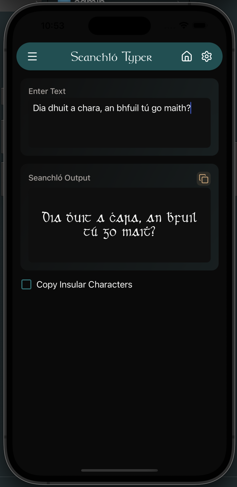

Support for special characters and diacritics with custom keyboard layouts (e.g., Irish fada keys, special character buttons).

#### Engaging Exercise Types

<table>
  <tr>
    <td width="50%">
      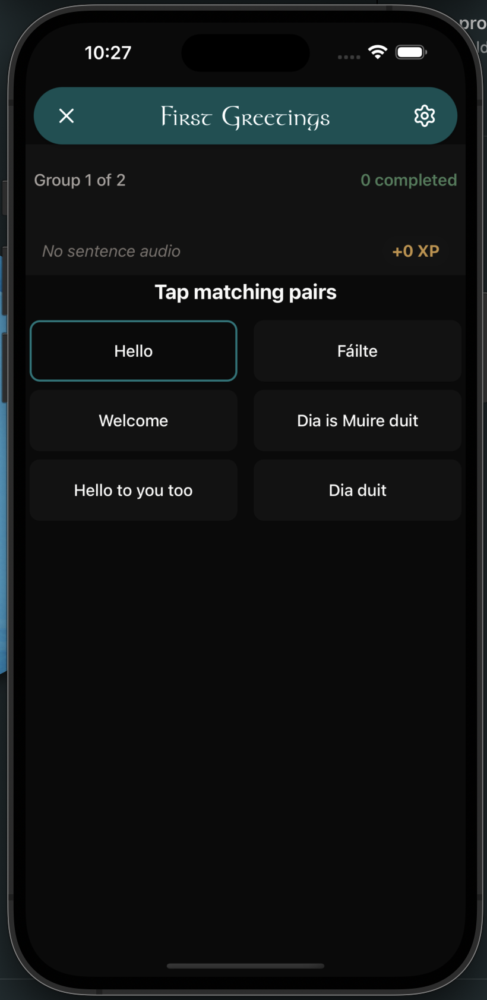
      <p align="center"><em>Matching pairs exercises</em></p>
    </td>
    <td width="50%">
      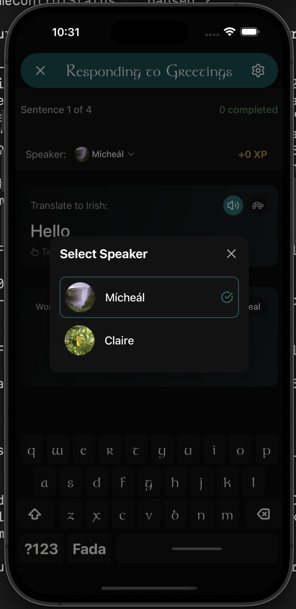
      <p align="center"><em>Multi-speaker conversational practice</em></p>
    </td>
  </tr>
</table>

#### Progress & Gamification

<table>
  <tr>
    <td width="50%">
      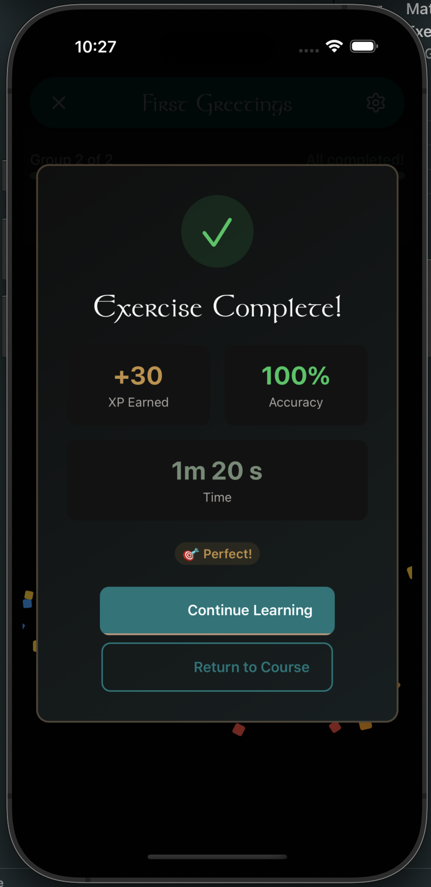
      <p align="center"><em>Instant feedback and statistics</em></p>
    </td>
    <td width="50%">
      
      <p align="center"><em>Unlock custom achievements</em></p>
    </td>
  </tr>
</table>

### 🛠️ **For Educators**

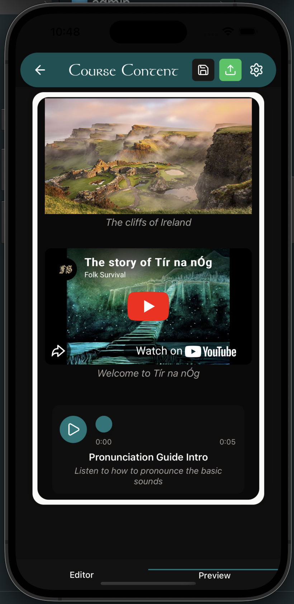

- **Admin Content Management System**: Create and organise courses, lessons, and exercises through an intuitive interface
- **Course Builder**: Structure your curriculum with lessons, exercises, and learning paths
- **Audio Integration**: Upload or record pronunciation guides directly in the admin panel
- **Speaker Management**: Define multiple speakers for conversational exercises
- **Multi-Language Support**: Manage courses for multiple languages from one platform
- **Flexible Deployment**: Host on your own infrastructure or use free cloud services

<br clear="right"/>

#### No-Code Content Creation

<table>
  <tr>
    <td width="50%">
      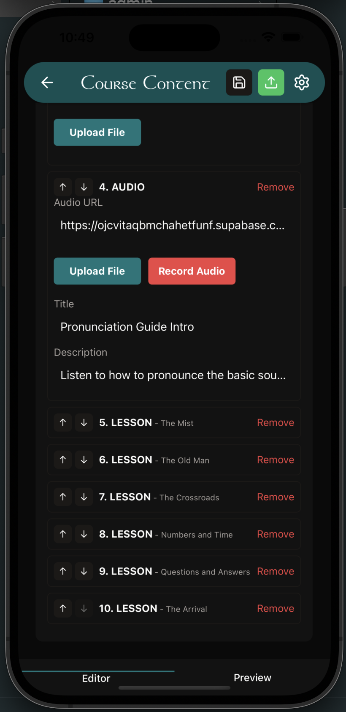
      <p align="center"><em>Easily add and organize lessons</em></p>
    </td>
    <td width="50%">
      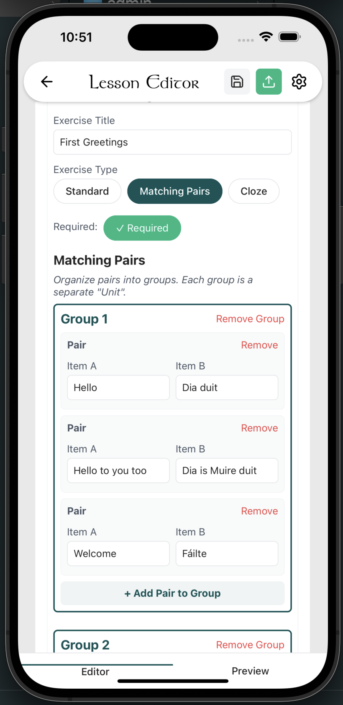
      <p align="center"><em>Create various exercise types</em></p>
    </td>
  </tr>
  <tr>
    <td width="50%">
      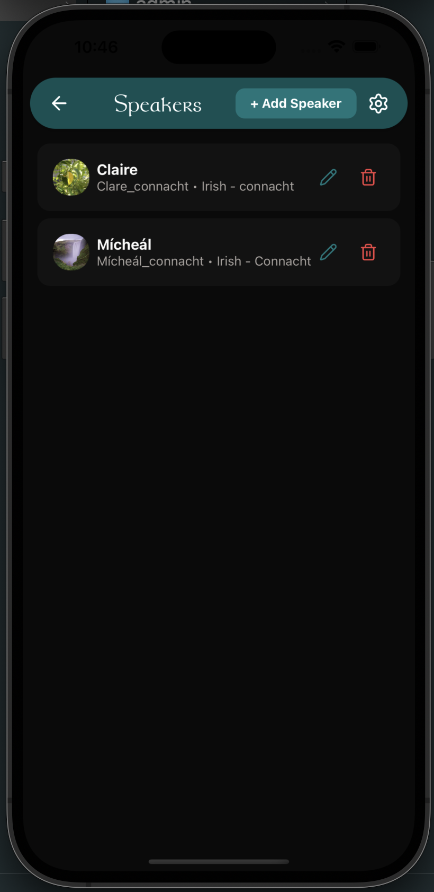
      <p align="center"><em>Manage speakers for dialogues</em></p>
    </td>
    <td width="50%">
      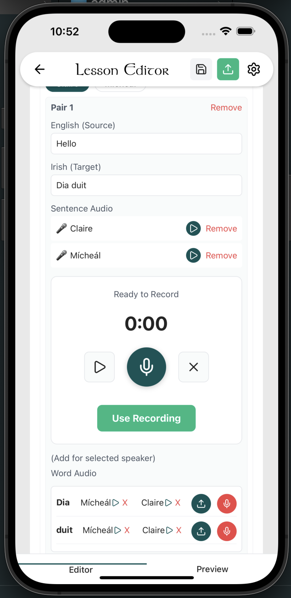
      <p align="center"><em>Record audio directly in-app</em></p>
    </td>
  </tr>
</table>

#### Advanced Features

<table>
  <tr>
    <td width="50%">
      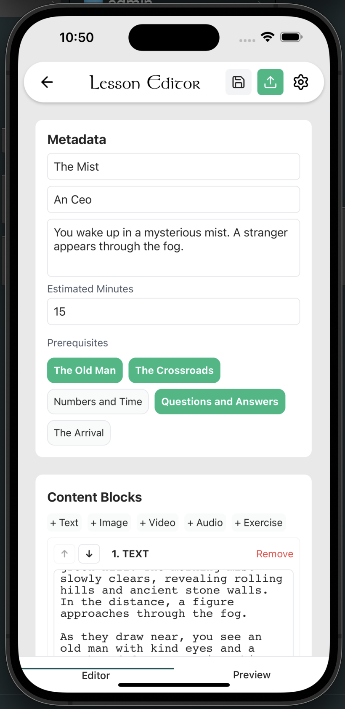
      <p align="center"><em>Set lesson prerequisites</em></p>
    </td>
    <td width="50%">
      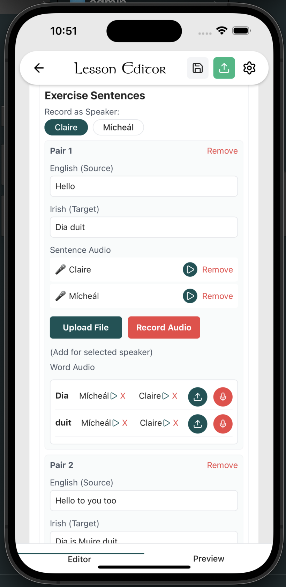
      <p align="center"><em>Word or sentence-level audio</em></p>
    </td>
  </tr>
</table>

---

## Complete Documentation

### **Getting Started**

**⚡ In a hurry?** See [QUICK_START.md](./QUICK_START.md) for a 5-step setup guide (under 1 hour)

**New to Navaria?** Follow these guides in order:

1. **[Community Setup Guide](./COMMUNITY_SETUP.md)** ⭐ **Start here!**
   - Step-by-step Supabase setup (free backend)
   - Database initialisation
   - Creating your first admin user
   - Running the app locally
   - **Estimated time: 30-45 minutes**

2. **[Admin Guide](./ADMIN_GUIDE.md)**
   - Building lessons and exercises
   - Creating languages and courses
   - Recording audio directly in-app
   - Managing speakers for dialogues
   - Content structure best practices

3. **[Deployment Guide](./DEPLOYMENT_GUIDE.md)**
   - Web deployment (Netlify, Vercel, Cloudflare Pages)
   - Mobile app deployment (Expo EAS Build)
   - App Store and Google Play submission
   - Custom domain setup

4. **[Supabase Limits & Scaling](./SUPABASE_LIMITS.md)**
   - Free tier capabilities (~400 students)
   - When to upgrade and cost estimates
   - Optimisation tips for growing deployments

### 🔧 **For Developers**

5. **[Development Guide](./DEVELOPMENT.md)**
   - Technical architecture
   - Local development setup
   - Project structure
   - Contributing guidelines
   - Windows development environment

---

## ⚡ Quick Start

Want to see Navaria in action? Get it running locally in minutes:

```bash
# 1. Clone the repository
git clone <repository-url>
cd navaria_languages

# 2. Install dependencies
npm install

# 3. Set up your Supabase backend
# See COMMUNITY_SETUP.md for detailed instructions

# 4. Configure environment variables
# Create a .env file with your Supabase credentials

# 5. Run the app
npm start (or `npm run web`)
# Press 'w' for web, 'i' for iOS, 'a' for Android
```

**For complete setup instructions, see [COMMUNITY_SETUP.md](./COMMUNITY_SETUP.md)**

### 🧪 Generating Test Data

If you want to quickly populate your local instance with a fully structured example course (Irish), you can run the seed script:

```bash
# Verify you have admin access first (see COMMUNITY_SETUP.md)
# Then run the seed script:
node scripts/seed-irish-course.js
```

This will create a complete "Beginner Irish" course with lessons, exercises, and audio placeholders.

---

## 🌟 Why Choose Navaria?

### ✅ **Completely Free**

- No licensing fees, ever
- Free backend hosting (Supabase free tier)
- Free web hosting options available
- Mobile builds through Expo (free tier available)

### ✅ **Fully Open Source**

- MIT License - use, modify, and distribute freely
- Transparent development
- Community-driven improvements
- No vendor lock-in

### ✅ **Easy to Deploy**

- Comprehensive documentation for non-technical users
- No coding required for content creation
- Deploy in under an hour
- Free hosting options for web and mobile

### ✅ **Designed for Language Preservation**

- Support for special characters and diacritics
- Custom keyboard layouts (Irish fada, etc.)
- Multi-dialect support
- Audio-first approach for pronunciation

### ✅ **Proven Technology**

- Built with React Native and Expo
- Scales from 10 to 10,000+ learners
- Works on web, iOS, and Android
- Active development and support

---

## 🗣️ Supported Languages

Navaria currently includes content support for:

- **Irish (Gaeilge)**: Standard, Munster, Connacht, Ulster dialects
- **Navajo (Diné bizaad)**
- **Māori (Te Reo Māori)**
- **Extensible for any language**: Add your own through the admin panel

---

## 💰 Cost & Hosting

### Free Tier (Perfect for Getting Started)

Using Supabase free tier and free web hosting:

- **Up to ~400 active students**
- **1GB file storage** (audio, images)
- **5GB bandwidth per month**
- **100% free forever**

See [SUPABASE_LIMITS.md](./SUPABASE_LIMITS.md) for detailed capacity planning.

### Scaling Beyond Free Tier

When you outgrow the free tier:

- **Supabase Pro**: $25/month for 8GB database, 100GB storage
- **Custom hosting**: Deploy to your own infrastructure
- **See [SUPABASE_LIMITS.md](./SUPABASE_LIMITS.md)** for cost breakdown

---

## 🤝 Community & Support

### Join the Navaria Community

- **Share Your Experience**: Help others deploying Navaria for their languages
- **Contribute**: Improve documentation, report bugs, suggest features
- **Collaborate**: Share course structures and pedagogical approaches (when appropriate)

### Get Help

- **Documentation**: Start with [COMMUNITY_SETUP.md](./COMMUNITY_SETUP.md)
- **Issues**: Report problems via GitHub Issues
- **Discussions**: Connect with other educators using Navaria

### Contributing

We welcome contributions! See [DEVELOPMENT.md](./DEVELOPMENT.md) for:

- How to set up a development environment
- Code structure and conventions
- How to submit improvements
- Feature development guidelines

---

## 📖 Example Use Cases

### Irish Language School

_"We deployed Navaria to teach Irish to 150 students across 5 courses. The free tier covers all our needs, and students love the gamification features."_

### Indigenous Language Revival

_"Our community uses Navaria to preserve our endangered language. We've created 30 lessons with native speaker audio and distribute it free to tribal members."_

### Private Language Tutor

_"I teach Māori through Navaria. The admin panel makes it easy to add new content, and my students can learn on their phones anywhere."_

---

## 🛡️ Technical Overview

### Built With Modern Technology

- **React Native & Expo**: Cross-platform mobile and web development
- **Supabase**: Backend-as-a-Service (PostgreSQL, authentication, storage)
- **TypeScript**: Type-safe development
- **Responsive Design**: Works on desktop, tablet, and mobile

### Key Capabilities

- **Network-durable**: Your progress is saved locally and synced automatically when connection is available.
- **Real-Time Progress**: Instant XP updates and achievement unlocks
- **Secure**: Row-level security, user authentication
- **Performant**: Optimised for slow networks and low-end devices
- **Accessible**: Designed for diverse learning abilities

For detailed technical information, see [DEVELOPMENT.md](./DEVELOPMENT.md).

---

## 📄 License

Navaria is free and open-source software licensed under the **MIT License**.

You are free to:

- ✅ Use Navaria for any purpose (commercial or non-commercial)
- ✅ Modify the code to suit your needs
- ✅ Distribute your modified or unmodified versions
- ✅ Use Navaria privately or publicly

See [LICENSE](./LICENSE) for full details.

---

## ✍️ A Message from the Author

# Navaria — Freedom for Language Preservation

Navaria was built following my experience co-founding a language-learning startup focused on language preservation. Differences in vision and values ultimately led me to believe the language and its community deserved a more open, honest, and independent foundation.

Navaria is the result of that belief.

---

A Modern, Independent Foundation

Navaria was developed from the ground up in just 30 days as a strict clean-room implementation. It is a fully independent platform designed for speed, flexibility, and long-term sustainability.

- Authored from scratch
  - Every line of code was designed and implemented by me in a single month of focused development.
- Modern technology stack
  - Built using a high-performance language and architecture chosen specifically for scalability, maintainability, and longevity.
- Built for the public good
  - Unlike proprietary platforms, Navaria is transparent, extensible, and open — owned by the communities that rely on it.

---

The Mission

The best response to closed systems is open ones.
The best way to protect cultural and linguistic heritage is to ensure the tools that support it can never be locked away.

Navaria belongs to the community. Forever. Free.

If you are an educator, school, or member of a community working to preserve an endangered language, this project is for you — with no fees, no restrictions, and no corporation controlling your access.

— Mícheál

## 🙏 Acknowledgements

Navaria is built with love for language preservation and education. We're grateful to:

- **Educators** preserving endangered languages worldwide
- **Open-source contributors** who make projects like this possible
- **The language learning community** for feedback and support
- **Supabase, Expo, and React Native** for providing excellent tools

---

## 📞 Get Started Today

Ready to preserve your language?

1. **[Read the Community Setup Guide](./COMMUNITY_SETUP.md)** (30-45 minutes)
2. **Deploy your instance** (free hosting available)
3. **Create your first course** using the [Admin Guide](./ADMIN_GUIDE.md)
4. **Share with your students** and start learning!

**Questions?** Open an issue on GitHub or check our comprehensive documentation.

---

**Navaria: Empowering language preservation, one lesson at a time.** 🌍📚

> This project was first released on GitHub on 2025-12-24 - as a gift to the world-wide language preservation community. I hope it helps. More is to be done, but it's a start.

If you’d like to support my ongoing work on Navaria and related language preservation projects, you can do so here:

👉 Patreon: [Click here](https://patreon.com/UncleMickHere)
